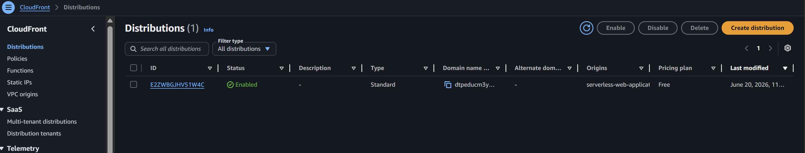
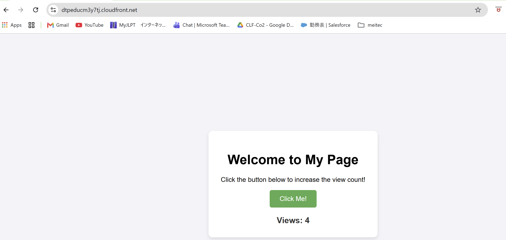

## Serverless Web Application

## Project Overview

A serverless web application built on AWS. The website is hosted on Amazon S3 and delivered through CloudFront. When a user clicks the button, AWS Lambda updates a counter stored in DynamoDB and returns the latest value to the webpage.

## Architecture

Click here to view Configuration and Results

  
| Description | Config | Screenshot |
|-------------|:--------|------------|
| **Route 53**   | 1. Created S3 bucket   2. Uploaded static website files   3. Enabled website hosting | |
| **CloudFront** | 1. Created CloudFront distribution   2. Connected S3 bucket as origin   3. Enabled HTTPS |  |
| S3 bucket | 1. Created S3 bucket   2. Uploaded static website files   3. Enabled website hosting |  |
| Lambda | 1. Created Python Lambda function   2. Connected Lambda to DynamoDB   3. Enabled Function URL |  |
| DynamoDB | 1. Created DynamoDB table   2. Partition Key: id   3. Stored visitor counter |  |

## Website
 

## Technologies Used

* Amazon S3
* Amazon CloudFront
* AWS Lambda
* Amazon DynamoDB
* Amazon Route 53
* HTML
* CSS
* JavaScript
* Python

