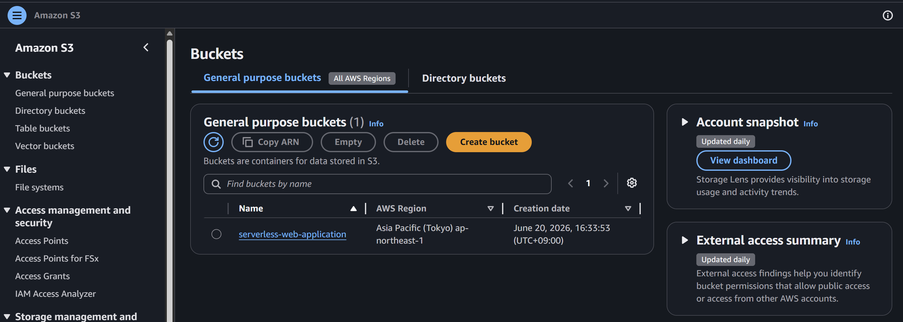
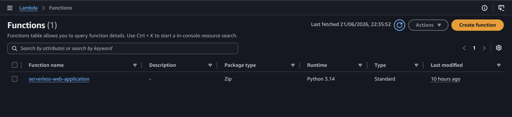
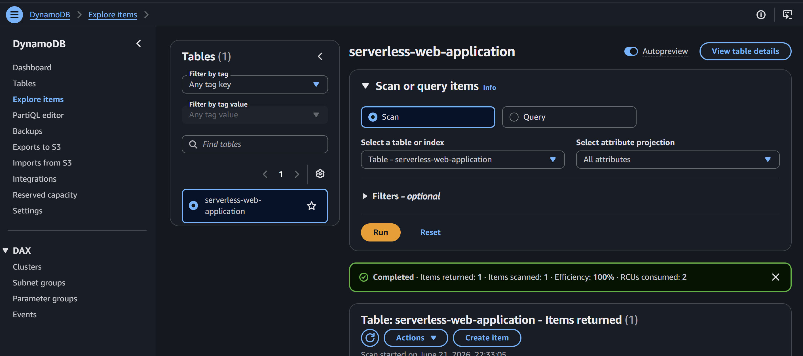

##Serverless Web Application
A serverless visitor counter application built using AWS.

##**Architecture**

<detail>

Click Here to view the configuration and result

| Description | Screenshot |
|-------------|------------|
| Architecture |  |
| Route 53   | |
| CloudFront |  |
| S3 bucket |  |
| Lambda |  |
| DynamoDB | 

</detail>
---

##**AWS Service Used**
-Amazon S3
-Amazon CloudFront
-AWS Lambda
-Amazon DynamoDB
-Route 53

##**Features**
-static website hosting
-Button click counter
-DynamoDB data storage
-Lambda backend
-Serverless architecture    

##**Demo**
dtpeducm3y7tj.cloudfront.net

